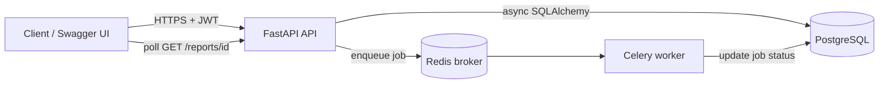

# FastAPI SaaS Starter

[](https://github.com/Gosai-om/fastapi-saas-starter/actions/workflows/ci.yml)


A production-style backend starter built with **FastAPI**, **async SQLAlchemy 2**, **PostgreSQL**,
**Alembic**, **Celery** and **Redis**. It covers the parts most real SaaS backends need on day one:
secure authentication, role-based access control, background jobs, migrations, tests and CI.

## Features

- **JWT authentication**: OAuth2 password flow, Argon2id password hashing, short-lived tokens
- **Role-based access control**: `admin`, `manager`, `user`, enforced server-side on every request
- **Instant revocation**: roles and active status are read from the database, not baked into the token
- **Background jobs**: report generation and welcome emails processed by a Celery worker
- **Async database layer**: SQLAlchemy 2.x (async) + asyncpg, Alembic migrations with naming conventions
- **Safe by default**: no password hashes in responses, no emails in logs, uniform login errors,
  constant-time user lookup, 404 (not 403) for other people's resources, paginated and bounded lists
- **Observability**: request-ID header and request-ID in every log line, `/health` endpoint with DB check
- **Quality**: 24 tests (pytest + httpx), Ruff lint/format, GitHub Actions CI incl. a PostgreSQL
  migration check
- **One-command local stack**: Docker Compose runs Postgres, Redis, migrations, API and worker

## Architecture



A request to `POST /api/v1/reports` stores a `pending` report and returns **202 Accepted**
immediately. The worker processes it and marks it `completed` (or `failed`); the client polls
`GET /api/v1/reports/{id}`.

## Quick start (Docker)

```bash
cp .env.example .env            # then set a real JWT_SECRET_KEY
docker compose up --build
```

- API docs (Swagger UI): http://localhost:8000/docs
- Health check: http://localhost:8000/health

Create the first admin:

```bash
docker compose exec api python -m app.scripts.create_admin --email admin@example.com --name "Admin"
```

## Local development (without Docker)

```bash
python -m venv .venv
source .venv/bin/activate            # Windows: .venv\Scripts\activate
pip install -r requirements-dev.txt
cp .env.example .env                 # point DATABASE_URL / REDIS_URL at your local services
alembic upgrade head
uvicorn app.main:app --reload
celery -A app.worker.celery_app worker --loglevel=INFO   # in a second terminal
```

## API overview

| Method | Path | Who | Description |
|---|---|---|---|
| POST | `/api/v1/auth/register` | public | Sign up (always gets the `user` role) |
| POST | `/api/v1/auth/login` | public | OAuth2 password login, returns a bearer token |
| GET | `/api/v1/auth/me` | any user | Current user's profile |
| GET | `/api/v1/users` | admin, manager | Paginated user list, optional `role` filter |
| PATCH | `/api/v1/users/{id}/role` | admin | Change a user's role (not your own) |
| PATCH | `/api/v1/users/{id}/status` | admin | Activate / deactivate a user (not yourself) |
| POST | `/api/v1/reports` | any user | Queue a report (`team_overview` needs manager/admin) |
| GET | `/api/v1/reports` | any user | Your reports (admins see all) |
| GET | `/api/v1/reports/{id}` | owner, admin | Report status and result |
| GET | `/health` | public | Liveness + database check |

## Permissions

| Action | user | manager | admin |
|---|:-:|:-:|:-:|
| Register / log in / view own profile | ✅ | ✅ | ✅ |
| Request `my_activity` report | ✅ | ✅ | ✅ |
| Request `team_overview` report | ❌ | ✅ | ✅ |
| List users | ❌ | ✅ | ✅ |
| Change roles / deactivate users | ❌ | ❌ | ✅ |
| View other users' reports | ❌ | ❌ | ✅ |

## Tests and quality checks

```bash
pytest -q                 # 24 tests, in-memory SQLite + fake task queue (no Docker needed)
ruff check . && ruff format --check .
```

CI runs the same checks, and also applies the migrations to a real PostgreSQL database,
verifies they match the models (`alembic check`), downgrades and upgrades again.

## Project structure

```
app/
  api/            routes (auth, users, reports) and shared dependencies
  core/           settings, security (JWT, Argon2), logging
  db/             declarative base and async session
  models/         SQLAlchemy models
  services/       business logic (kept out of the routes, tested directly)
  worker/         Celery app and tasks
  scripts/        create_admin
alembic/          migrations
tests/            pytest suite
```

## Security notes

- Set a long random `JWT_SECRET_KEY`; the app refuses to start without one, and refuses the
  example value when `ENVIRONMENT=production`.
- Tokens expire after 30 minutes by default (`ACCESS_TOKEN_EXPIRE_MINUTES`).
- CORS is closed unless you list origins in `CORS_ORIGINS`.
- Put the API behind HTTPS (a reverse proxy or your platform's load balancer) in production.

## Roadmap

- Refresh tokens with rotation
- Rate limiting on login and registration
- Real email provider for the welcome email (currently logged)
- Audit log of admin actions

## License

MIT © 2026 Om Gosai
